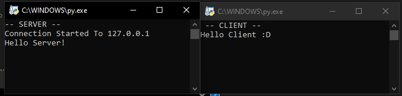

# sockets-with-asyncio
## What it is?
This is an example of how to use pythons built in module asyncio by using asyncio.Protocol to create A TCP server

## What it does?
This code contains a client.py and server.py. The client.py is placed on a user’s device such as a desktop pc then the server.py is placed on a server such as a VPS with python installed, the script is always running and with asyinco this allows us to handle multiple requests at a time from different clients meaning the server can run efficiently by using multiple threads which make it higher performance.

## How it looks?

